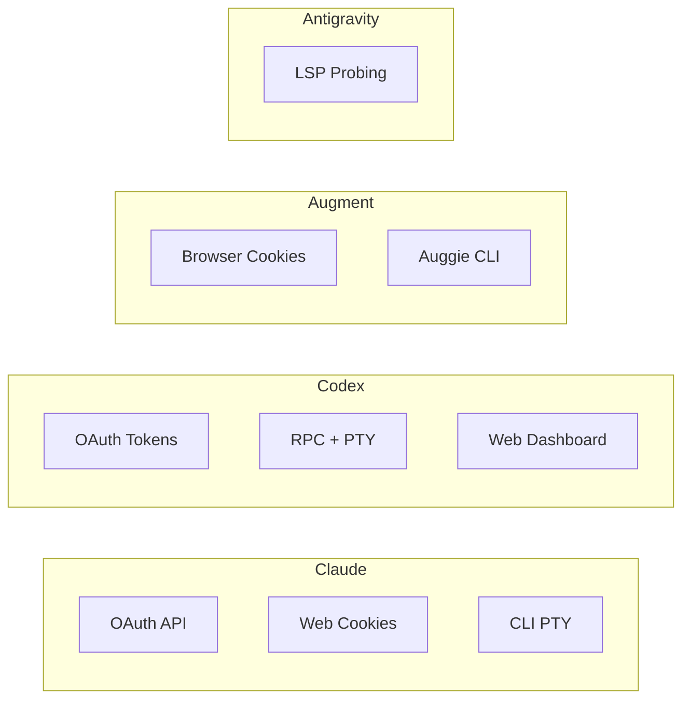
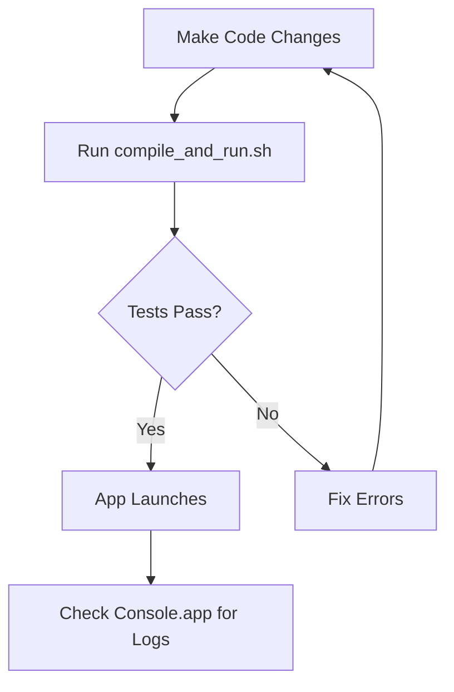
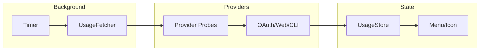

# docs — docs

<think>
The user wants me to write comprehensive documentation for the **docs** module. Looking at the provided source files, I can see this is a documentation directory containing various markdown files for the CodexBar application.

Let me analyze the files provided:
1. `docs/CNAME` - Contains `codexbar.app`
2. `docs/DEVELOPMENT.md` - Development workflow guide
3. `docs/DEVELOPMENT_SETUP.md` - Development setup guide
4. `docs/FORK_QUICK_START.md` - Fork quick start guide
5. `docs/FORK_ROADMAP.md` - Fork roadmap
6. `docs/FORK_SETUP.md` - Fork setup and configuration
7. `docs/KEYCHAIN_FIX.md` - Keychain behavior documentation
8. `docs/QUOTIO_ANALYSIS.md` - Analysis of quotio for inspiration
9. `docs/RELEASING.md` - Release process
10. `docs/TODO.md` - Pending items
11. `docs/UPSTREAM_STRATEGY.md` - Upstream management strategy
12. `docs/amp.md` - Amp provider documentation
13. `docs/antigravity.md` - Antigravity provider documentation
14. `docs/architecture.md` - Architecture overview
15. `docs/augment.md` - Augment provider documentation
16. `docs/claude-comparison-since-0.18.0beta2.md` - Claude fetch comparison
17. `docs/claude.md` - Claude provider documentation
18. `docs/cli.md` - CodexBar CLI documentation
19. `docs/codex-oauth.md` - Codex OAuth implementation plan


20. `docs/cursor.md` - Cursor provider documentation (file not present in the provided source)

Since the cursor documentation is missing from the source files, I'll focus on creating documentation for the docs module that covers the existing provider guides, architecture, development workflows, and fork management strategies.
</think>

# CodexBar Documentation Module

This module contains all user-facing and developer documentation for the CodexBar application. It serves as the central knowledge base for contributors, fork maintainers, and end users.

## Module Overview

The documentation is organized into several categories:

- **Provider Guides**: Individual documentation for each supported provider (Augment, Claude, Codex, Amp, Antigravity)
- **Development**: Setup, building, and workflow documentation
- **Fork Management**: Guides for maintaining the topoffunnel fork
- **Architecture**: Technical architecture and design documentation
- **Release**: Release process and distribution guides

## Provider Documentation

### Core Providers

| Provider | File | Description |
|----------|------|-------------|
| Claude | `claude.md` | OAuth API, web API (cookies), CLI PTY, and local cost usage |
| Codex | `codex-oauth.md` | OAuth token handling and usage API integration |
| Augment | `augment.md` | Cookie-based authentication with automatic session keepalive |
| Amp | `amp.md` | Browser cookie scraping for free-tier usage tracking |
| Antigravity | `antigravity.md` | Local LSP probing for quota and plan information |

### Authentication Methods by Provider



## Development Documentation

### Getting Started

1. **Initial Setup**: Follow `DEVELOPMENT_SETUP.md` to configure your development environment
2. **Build & Run**: Use `./Scripts/compile_and_run.sh` for the full development cycle
3. **Testing**: Run `swift test` for unit tests

### Key Development Workflows



### Debugging Tools

- **Console.app**: Filter by "codexbar" for application logs
- **File logging**: Enable in Settings → Debug → Logging → "Enable file logging"
- **Debug pane**: Settings → Debug provides provider-specific debug information

## Fork Management

The topoffunnel fork maintains several enhancements over the upstream repository:

### Fork-Specific Features

- **Augment Provider**: Full integration with Augment Code API
- **Enhanced Security**: Improved keychain handling to reduce permission prompts
- **Cookie Management**: Automatic session keepalive with Chrome Beta support
- **Bug Fixes**: Cursor bonus credits, cookie domain filtering

### Upstream Synchronization

The fork maintains three git remotes:

```bash
# origin: topoffunnel/CodexBar (your fork)
# upstream: steipete/CodexBar (original)
# quotio: nguyenphutrong/quotio (inspiration)
```

See `UPSTREAM_STRATEGY.md` for detailed synchronization workflows.

## Architecture

### Module Structure

```
Sources/
├── CodexBar/           # Main app (SwiftUI + AppKit)
├── CodexBarCore/       # Shared business logic
├── CodexBarWidget/     # WidgetKit extension
├── CodexBarCLI/       # Command-line interface
├── CodexBarMacros/     # SwiftSyntax macros
└── CodexBarClaudeWatchdog/  # Claude CLI PTY helper
```

### Data Flow



### Key Components

- **UsageStore**: Central state management for usage data
- **SettingsStore**: User preferences and feature flags
- **StatusItemController**: Menu bar icon and menu management
- **ProviderImplementations**: Individual provider fetch logic

## CLI Reference

The CodexBar CLI (`codexbar`) provides command-line access to usage data:

```bash
# Basic usage
codexbar

# JSON output
codexbar --format json --pretty

# Specific provider
codexbar --provider claude
codexbar --provider codex

# Cost usage (local log scan)
codexbar cost

# Configuration validation
codexbar config validate
```

See `cli.md` for complete CLI documentation.

## Release Process

### Release Checklist

1. Update versions in scripts/Info.plist and CHANGELOG
2. Run code formatting: `swiftformat`, `swiftlint`
3. Build and sign: `./Scripts/sign-and-notarize.sh`
4. Generate Sparkle appcast: `./Scripts/make_appcast.sh`
5. Create GitHub release with zip and dSYM
6. Update Homebrew tap

### Notarization Requirements

- Developer ID Application certificate
- ASC API credentials in environment
- Sparkle private key for appcast signing
- Deep code signing with timestamp

See `RELEASING.md` for complete release documentation.

## Configuration

### Config File Location

`~/.codexbar/config.json`

### Key Configuration Options

- **Providers**: Enable/disable and configure providers
- **Token Accounts**: Multi-account support for OAuth/cookies
- **Cookie Source**: Auto/Manual per provider
- **Refresh Interval**: Usage polling frequency
- **Display Settings**: Menu bar organization, text format

## Troubleshooting

### Common Issues

| Issue | Solution |
|-------|----------|
| Keychain prompts | Run `./Scripts/setup_dev_signing.sh` for stable certificate |
| Cookie import fails | Verify browser login, try manual import |
| App won't launch | Check Console.app for errors, verify Sparkle.framework |
| Build fails | Run `swift package clean`, check for missing dependencies |

### Debug Logging

```bash
# Enable verbose logging
export CODEXBAR_LOG_LEVEL=debug

# Check logs
log show --predicate 'subsystem == "com.steipete.codexbar"' --last 10m
```

## Related Documentation

- [Provider Authoring Guide](provider.md) - Creating new providers
- [Development Guide](DEVELOPMENT.md) - Build and test instructions
- [Fork Roadmap](FORK_ROADMAP.md) - Future development plans
- [Upstream Strategy](UPSTREAM_STRATEGY.md) - Fork synchronization