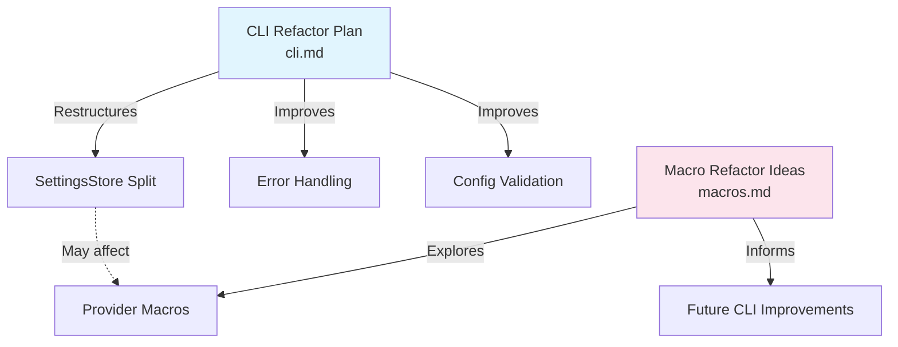

# docs

<think>
The user wants me to write documentation for the **docs — refactor** module. Let me analyze what's provided:

1. **CLI Refactor Plan** (`cli.md`) - A detailed plan for refactoring the CodexBar CLI with specific goals around:
   - JSON-only error handling
   - Per-provider errors
   - Config validation
   - SettingsStore split into smaller files

2. **Macro Refactor Ideas** (`macros.md`) - Ideas for improving provider macro ergonomics and related refactoring

The call graph shows no internal calls or execution flows - this is a documentation-only module containing planning documents.

Let me structure the documentation to cover:
1. Module Overview - What this module is
2. The Two Planning Documents - detailed coverage of each
3. How they relate to each other and to the broader codebase

Key points to include:
- The CLI refactor is a concrete, multi-step plan for improving error handling and configuration
- The Macro refactor is more exploratory, looking at ergonomic improvements for the provider macros
- They are related but serve different purposes: one is actionable plan, the other is brainstorming

I should include a Mermaid diagram since it would help clarify the relationship between these planning documents and the eventual code changes.

Let me write concise but comprehensive documentation that:
- Explains what this module is (refactoring planning docs)
- Details each sub-document
- Shows how they relate to each other
- Links to the child pages for more detail
</think>

# Refactor Planning Documentation

This module contains planning documents that outline proposed refactoring work for the CodexBar codebase. These are not active code modules — they document intended improvements to the application's architecture and developer experience.

## Overview

The **refactor** documentation module contains two related planning documents that address distinct but interconnected areas of improvement:

- **[CLI Refactor Plan](cli.md)** — A concrete, multi-step refactoring plan focused on improving error handling, configuration validation, and code organization in the command-line interface.
- **[Macro Refactor Ideas](macros.md)** — Exploratory documentation examining potential ergonomic improvements to the provider macro system.

Both documents target the same codebase but address different layers: the CLI refactor focuses on integration concerns (errors, config, settings), while the macro refactor examines the provider abstraction layer itself.

## How They Relate

The CLI refactor is an actionable plan with defined steps, while the macro refactor documents brainstorming that may inform future CLI improvements. The SettingsStore split mentioned in the CLI plan has overlap with macro-related refactoring, as provider configuration lives at the intersection of both concerns.

## Documents

| Document | Purpose | Status |
|----------|---------|--------|
| [CLI Refactor Plan](cli.md) | Structured plan for CLI improvements | Defined steps |
| [Macro Refactor Ideas](macros.md) | Exploratory notes on macro ergonomics | Brainstorming |

The CLI refactor plan contains specific, implementable steps. The macro ideas document is exploratory — its suggestions may be adopted, modified, or deferred based on priorities.