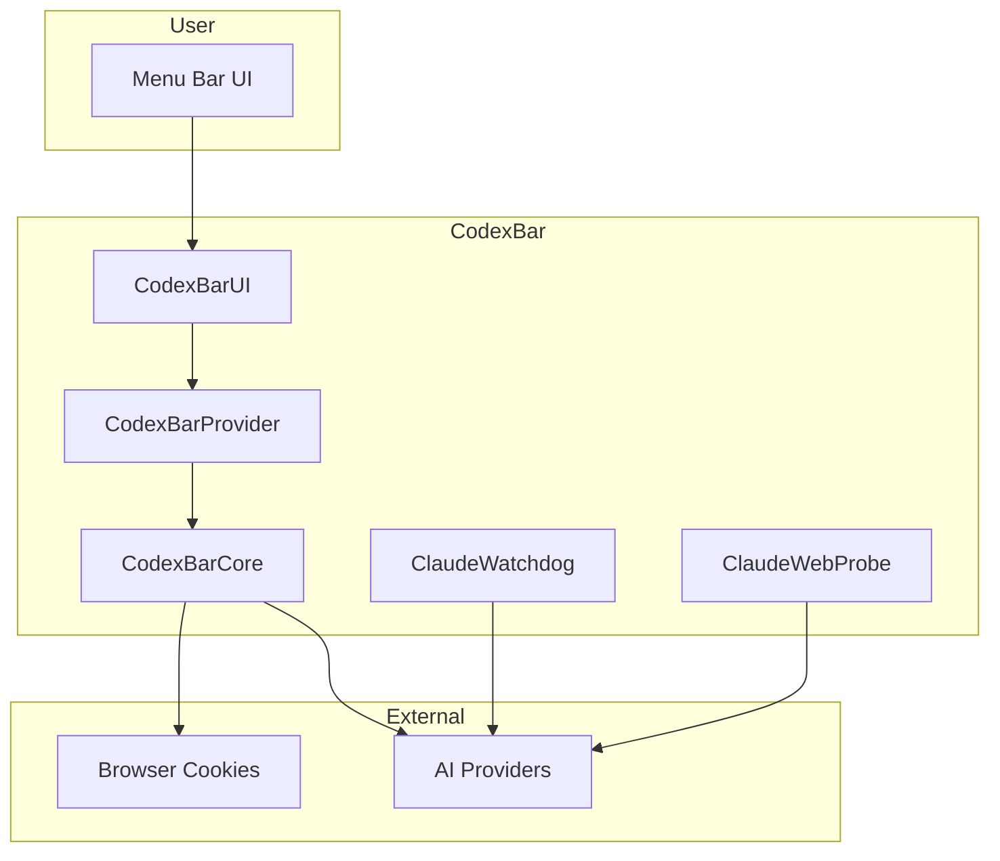

# CodexBar — Wiki

<think>
The user wants me to write an overview page for a repository wiki. This is a documentation task for a project called CodexBar. Let me analyze what I know about this project:

1. **Project Name**: CodexBar
2. **Type**: macOS 14+ menu bar app
3. **Purpose**: Shows AI provider (Codex, Claude, Cursor, etc.) usage limits in the menu bar
4. **Features**:
   - Status item per provider
   - Shows session + weekly limits where available
   - Shows when each window resets
   - Merge Icons mode with provider switcher
   - Optional Overview tab
   - No Dock icon, minimal UI
   - Dynamic bar icons
5. **Platform**: macOS 14+ (Sonoma), with Linux CLI support via Omarchy

Looking at the modules provided:
- **Root**: Configuration files (README, Package.swift, package.json, etc.)
- **CodexBar.app**: The macOS app bundle contents
- **CodexBar.xcodeproj**: The Xcode project
- **Icon.icon**: Icon configuration
- **Scripts**: Build, release, and utility scripts
- **Sources**: Multiple sub-modules (CodexBar, CodexBarCLI, etc.)
- **Tests**: Test suites
- **TestsLinux**: Linux-specific tests
- **docs**: Documentation (refactor plans, CLI plans)
- **sessions**: Session memos (progress reports)

The key modules in Sources:
- **CodexBar**: Main macOS menu bar application
- **CodexBarCLI**: Command-line interface
- **CodexBarClaudeWatchdog**: Process supervisor for Claude CLI


- **CodexBarClaudeWebProbe**: Network probe for Claude.ai API
- **CodexBarCore**: Shared utilities (browser cookies, config, keychain, notifications, logging)
- **CodexBarProvider**: Provider interface
- **CodexBarUI**: Menu bar UI

I need to create a welcoming overview that references actual module names with a simple Mermaid diagram showing the core architecture (max 10 nodes), explains key flows without dumping raw data, includes setup instructions, and references the scripts for building and running the project.
</think>

# CodexBar 🎚️

Welcome to **CodexBar**, a tiny macOS 14+ menu bar application that keeps your AI provider usage limits visible at a glance.

## What It Does

CodexBar displays real-time usage information for AI services directly in your menu bar — no need to open a browser or dig into settings. It tracks:

- **Session limits** — tokens used in the current session
- **Weekly limits** — where available
- **Reset times** — exactly when each provider's window resets

Supported providers include Codex, Claude, Cursor, Gemini, Antigravity, Droid (Factory), Copilot, z.ai, Kiro, Vertex AI, Augment, Amp, JetBrains AI, and OpenRouter.

You can enable a status item per provider, or use **Merge Icons mode** with a provider switcher and optional Overview tab. The app runs entirely in the menu bar with no Dock icon.

## Architecture

The codebase is organized into several key modules under [Sources](Sources.md):

- **[CodexBar](CodexBar.md)** — The main macOS menu bar application. This is the app you launch; it manages status items, the menu UI, and provider data display.
- **[CodexBarUI](CodexBarUI.md)** — The menu bar interface layer. Handles the dropdown menus, status item rendering, and dynamic icon updates.
- **[CodexBarProvider](CodexBarProvider.md)** — The provider abstraction layer. Each AI service implements this interface to fetch and report usage data.
- **[CodexBarCore](CodexBarCore.md)** — Shared utilities used across the app: browser cookie handling, configuration management, keychain storage, notifications, and logging.
- **[CodexBarCLI](CodexBarCLI.md)** — A command-line interface for querying usage and cost data. Useful for scripting and headless environments.
- **[CodexBarClaudeWatchdog](CodexBarClaudeWatchdog.md)** — A process supervisor that monitors Claude CLI and ensures the local API remains available.
- **[CodexBarClaudeWebProbe](CodexBarClaudeWebProbe.md)** — A network probe that tests connectivity to Claude.ai API endpoints.



The CLI lives separately in [CodexBarCLI](CodexBarCLI.md) and can query the same provider data without the GUI.

## Key Flows

**Menu Bar Display Flow**: When you click the menu bar icon, [CodexBarUI](CodexBarUI.md) renders the dropdown. It queries each enabled provider through [CodexBarProvider](CodexBarProvider.md), which fetches data via [CodexBarCore](CodexBarCore.md)'s cookie and network utilities.

**CLI Query Flow**: Running `codexbar` from the terminal invokes [CodexBarCLI](CodexBarCLI.md), which directly uses [CodexBarCore](CodexBarCore.md) and [CodexBarProvider](CodexBarProvider.md) to output JSON-formatted usage data.

**Watchdog Flow**: [CodexBarClaudeWatchdog](CodexBarClaudeWatchdog.md) runs as a background process, monitoring the Claude CLI binary and restarting it if needed to keep the local API endpoint alive.

## Setup

### Requirements

- macOS 14+ (Sonoma)
- Xcode 15+

### Quick Start

```bash
# Install dependencies
brew install mint

# Build and run
make start
```

The project includes several npm scripts in [package.json](Scripts.md) (accessible via `npm run` or `make`):

| Command | Description |
|---------|-------------|
| `start` | Build and launch the app |
| `start:debug` | Build with debug symbols |
| `start:release` | Build release binary |
| `test` | Run the test suite |
| `lint` | Run SwiftLint |
| `docs:list` | List all documentation |

Run `make` or `npm run` to see all available commands.

### Linux (CLI Only)

On Linux, only the CLI is available:

```bash
brew install steipete/tap/codexbar
```

Or download `CodexBarCLI-v<tag>-linux-<arch>.tar.gz` from [GitHub Releases](https://github.com/steipete/CodexBar/releases).

## Where to Go Next

- [CodexBar](CodexBar.md) — Main app entry point and configuration
- [CodexBarProvider](CodexBarProvider.md) — Adding support for a new AI provider
- [CodexBarCLI](CodexBarCLI.md) — CLI usage and JSON output format
- [Scripts](Scripts.md) — Build, release, and utility scripts
- [Tests](Tests.md) — Running and extending the test suite

Happy coding! 🎉