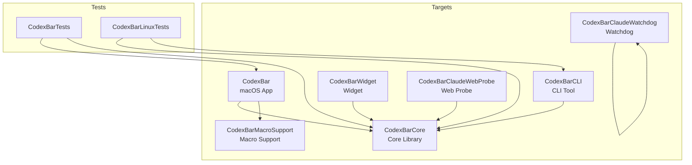
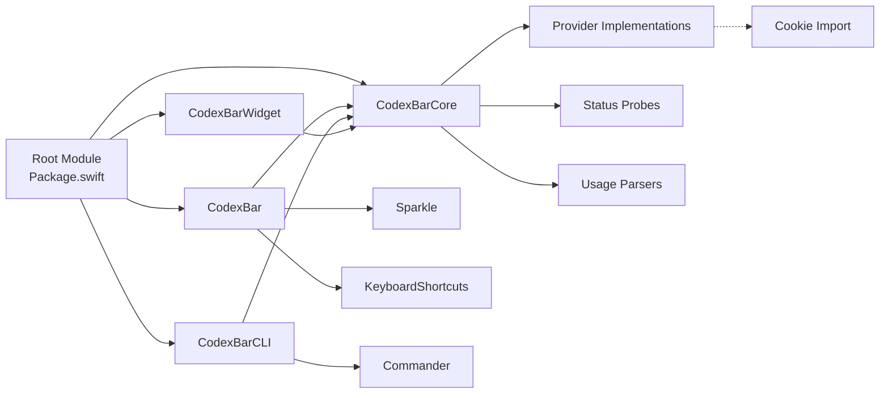

# Root

<think>
The user is asking me to write documentation for the "Root" module. Let me analyze what this module contains based on the provided source code files.

Looking at the files provided:
- `AGENTS.md` - Repository guidelines
- `FORK_STATUS.md` - Fork status tracking
- `IMPLEMENTATION_SUMMARY.md` - Implementation summary
- `Package.swift` - Swift package configuration
- `README.md` - Main documentation
- `appcast.xml` - Sparkle update feed
- `package.json` - npm scripts
- `version.env` - Version info

These are all root-level configuration files for the CodexBar project. The "Root" module here seems to refer to the top-level project configuration and documentation files.

Looking at the Package.swift, this is a Swift package that builds:
- CodexBarCore - Core library
- CodexBarMacroSupport - Macro support
- CodexBarCLI - Command line interface
- CodexBar - macOS menu bar app
- CodexBarWidget - Widget extension
- CodexBarClaudeWatchdog - Claude watchdog
- CodexBarClaudeWebProbe - Claude web probe
- Various test targets

The "Root" module documentation should cover:
1. Project overview and what CodexBar is
2. Package structure and targets
3. Dependencies
4. Build configuration
5. Version management
6. How this connects to the rest of the codebase

Let me write comprehensive documentation for this root module.
</think>

# Root Module Documentation

The **Root** module represents the top-level configuration and documentation layer for CodexBar — a macOS menu bar application that monitors AI provider usage limits. This module contains the Swift Package Manager configuration, project metadata, build scripts, and core documentation files that tie the entire codebase together.

## Overview

CodexBar is a lightweight macOS 14+ menu bar utility that displays usage quotas for multiple AI providers (Codex, Claude, Cursor, Gemini, and many others) directly in the menu bar. It tracks session and weekly limits, shows reset countdowns, and provides a unified interface for monitoring AI credits across providers.

The Root module serves as the project's entry point, defining:

- **Package structure** — All Swift targets and their dependencies
- **Build configuration** — Platforms, compilation settings, resources
- **Version management** — Marketing version and build numbers
- **Project metadata** — README, changelog, release automation

## Package Structure

The `Package.swift` defines a multi-target Swift package with platform-specific components:



### Core Targets

| Target | Platform | Purpose |
|--------|----------|---------|
| `CodexBar` | macOS | Main menu bar application |
| `CodexBarCore` | All | Shared logic for provider integration, status probing, usage parsing |
| `CodexBarMacroSupport` | All | Swift macro definitions for compile-time code generation |
| `CodexBarCLI` | All | Command-line interface for scripts and CI |
| `CodexBarWidget` | macOS | WidgetKit extension mirroring menu bar state |
| `CodexBarClaudeWatchdog` | macOS | Background process monitoring Claude availability |
| `CodexBarClaudeWebProbe` | macOS | Web-based usage probing for Claude |

### Test Targets

| Target | Platform | Purpose |
|--------|----------|---------|
| `CodexBarTests` | macOS | Full XCTest suite for all macOS functionality |
| `CodexBarLinuxTests` | Linux | Cross-platform CLI tests |

## Dependencies

The package declares five external dependencies:

```swift
// Package.swift dependencies
dependencies: [
    .package(url: "https://github.com/sparkle-project/Sparkle", from: "2.6.0"),
    .package(url: "https://github.com/steipete/Commander", from: "0.2.1"),
    .package(url: "https://github.com/apple/swift-log", from: "1.5.0"),
    .package(url: "https://github.com/sindresorhus/KeyboardShortcuts", from: "1.16.0"),
    .package(path: "../SweetCookieKit"),  // Local dependency
]
```

### Dependency Roles

- **Sparkle** — Auto-update framework for macOS app updates via `appcast.xml`
- **Commander** — CLI argument parsing for `CodexBarCLI`
- **swift-log** — Structured logging throughout all targets
- **KeyboardShortcuts** — Global keyboard shortcut support in the menu bar app
- **SweetCookieKit** — Browser cookie extraction (Chrome, Firefox, Safari, etc.)

## Build Configuration

### Platform Requirements

```swift
platforms: [
    .macOS(.v13),  // Minimum: macOS 13 (Ventura)
]
```

> **Note:** While the package declares macOS 13 as minimum, some features (like certain menu bar animations) require macOS 14+ or macOS 15+. See `README.md` for full requirements.

### Conditional Compilation

The package uses `#if os(macOS)` to include macOS-only targets:

```swift
#if os(macOS)
    targets.append(contentsOf: [
        .executableTarget(name: "CodexBar", ...),
        .executableTarget(name: "CodexBarWidget", ...),
        // ... other macOS targets
    ])
    targets.append(.testTarget(name: "CodexBarTests", ...))
#endif
```

This allows Linux builds to compile and test the CLI and core library without GUI dependencies.

### Resource Handling

The main `CodexBar` target includes resources:

```swift
resources: [
    .process("Resources"),
]
```

These include app icons, menu bar assets, and any bundled configuration files.

### Swift Settings

The main app target defines compile-time flags:

```swift
swiftSettings: [
    .define("ENABLE_SPARKLE"),
]
```

This enables Sparkle update checking in the app while keeping the core library platform-agnostic.

## Version Management

Version information lives in two places:

### `version.env`

```
MARKETING_VERSION=0.18.0-beta.3
BUILD_NUMBER=51
```

- **MARKETING_VERSION** — User-facing version string (semver)
- **BUILD_NUMBER** — Continuous integration build identifier

### `appcast.xml`

The Sparkle update feed (`appcast.xml`) lists all releases with:

- Version strings and build numbers
- Release notes (changelog)
- Download URLs
- Code signatures for secure updates

```xml
<item sparkle:channel="beta">
    <title>0.18.0-beta.3</title>
    <sparkle:version>51</sparkle:version>
    <sparkle:shortVersionString>0.18.0-beta.3</sparkle:shortVersionString>
    <enclosure url="..." sparkle:edSignature="..."/>
</item>
```

## Build and Run

### Quick Start

```bash
# Development build
swift build

# Release build
swift build -c release

# Run tests
swift test

# Package the macOS app
./Scripts/package_app.sh
```

### Development Loop

The project includes a convenience script for rapid iteration:

```bash
./Scripts/compile_and_run.sh
```

This script:
1. Kills any running CodexBar instance
2. Runs `swift build` and `swift test`
3. Packages the app bundle
4. Launches the new build
5. Confirms the app stays running

### Package Scripts

| Script | Purpose |
|--------|---------|
| `Scripts/package_app.sh` | Build `CodexBar.app` bundle |
| `Scripts/compile_and_run.sh` | Full dev loop (build → test → package → launch) |
| `Scripts/sign-and-notarize.sh` | Notarize for distribution (arm64) |
| `Scripts/make_appcast.sh` | Generate update feed |
| `Scripts/build_icon.sh` | Render app icon variants |
| `Scripts/lint.sh` | Run SwiftFormat and SwiftLint |

## Project Metadata

### `package.json` — npm Scripts

The project uses pnpm/npm for script orchestration:

```json
{
  "scripts": {
    "start": "./Scripts/compile_and_run.sh",
    "build": "swift build",
    "test": "swift test",
    "release": "./Scripts/package_app.sh release",
    "lint": "./Scripts/lint.sh lint",
    "format": "./Scripts/lint.sh format"
  }
}
```

This allows developers to use familiar commands (`pnpm start`, `pnpm test`) regardless of the underlying shell scripts.

### Documentation Structure

```
docs/
├── providers.md      # Provider overview
├── provider.md       # Authoring guide for new providers
├── architecture.md   # System architecture
├── refresh-loop.md   # Usage refresh timing
├── status.md        # Status polling
├── ui.md            # Menu bar UI
├── cli.md           # CLI reference
├── sparkle.md       # Auto-update
├── RELEASING.md     # Release checklist
└── [provider].md   # Individual provider docs (claude.md, cursor.md, etc.)
```

## Relationship to Other Modules

The Root module orchestrates the entire codebase. While it doesn't contain runtime logic, it defines how all other modules connect:



### Key Integrations

1. **CodexBarCore** — The shared engine that all other targets depend on. Contains provider protocols, status probing infrastructure, and usage parsing.

2. **CodexBar (macOS app)** — The primary consumer of Core, adding:
   - Menu bar UI (`NSStatusItem`)
   - Preferences window
   - Sparkle integration
   - Keyboard shortcuts

3. **CodexBarCLI** — Headless consumer of Core for:
   - Scriptable usage queries
   - CI/CD integration
   - Linux support

4. **CodexBarWidget** — Mirrors app state via WidgetKit for macOS Notification Center

## Fork Considerations

This codebase is maintained as a fork with additional provider support (notably Augment). The Root configuration supports:

- **Multi-upstream monitoring** — Scripts track both original (`steipete/CodexBar`) and fork-specific changes
- **Selective sync** — Cherry-pick upstream commits without merging provider removals
- **Dual attribution** — About pane credits both original author and fork maintainer

See `FORK_STATUS.md` and `docs/UPSTREAM_STRATEGY.md` for fork-specific workflows.

## Quick Reference

| Item | Value |
|------|-------|
| Package Name | `CodexBar` |
| Minimum macOS | 13 (Ventura) |
| Recommended macOS | 14+ (Sonoma) |
| Swift Version | 5.7+ |
| Package Manager | SwiftPM |
| License | MIT |
| Main Author | Peter Steinberger (@steipete) |

---

The Root module is intentionally lightweight — it defines *what* gets built rather than *how* it works. For implementation details, see:

- **Architecture**: `docs/architecture.md`
- **Provider system**: `docs/providers.md`
- **Core module**: `Sources/CodexBarCore/` documentation