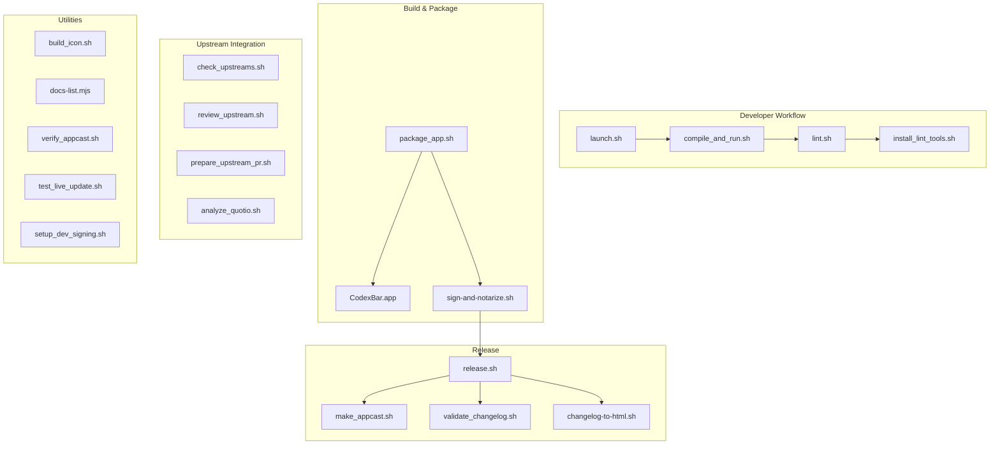

# Scripts

<think>
The user wants me to write documentation for the Scripts module. Let me analyze what I've been given:

1. **Source Code**: 21 shell scripts in the Scripts directory:
   - analyze_quotio.sh - Analyzes the quotio fork for patterns
   - build_icon.sh - Generates macOS app icons
   - changelog-to-html.sh - Converts changelog sections to HTML
   - check-release-assets.sh - Verifies release artifacts
   - check_upstreams.sh - Checks for upstream changes
   - compile_and_run.sh - Full build pipeline (kill, build, package, launch)
   - docs-list.mjs - Lists markdown docs with metadata
   - install_lint_tools.sh - Downloads SwiftFormat and SwiftLint
   - launch.sh - Simple app launcher
   - lint.sh - Runs linting/formatting
   - make_appcast.sh - Creates Sparkle appcast
   - package_app.sh - Builds and bundles the app
   - prepare_upstream_pr.sh - Creates branches for upstream PRs
   - release.sh - Full release pipeline
   - review_upstream.sh - Creates review branches for upstream changes
   - setup_dev_signing.sh - Creates dev certificates
   - sign-and-notarize.sh - Code signs and notarizes for release
   - test_live_update.sh - Tests Sparkle updates
   - validate_changelog.sh - Validates CHANGELOG.md format
   - verify_appcast.sh - Verifies appcast signatures

2. **Call Graph & Execution Flows**: None detected - these are standalone scripts

This is a collection of utility scripts for the CodexBar project. They fall into several categories:
- **Build & Release**: compile_and_run.sh, package_app.sh, release.sh, sign-and-notarize.sh
- **Upstream Sync**: check_upstreams.sh, review_upstream.sh, prepare_upstream_pr.sh, analyze_quotio.sh


- **Development Tools**: launch.sh, lint.sh, install_lint_tools.sh, setup_dev_signing.sh, docs-list.mjs
- **Release Automation**: changelog-to-html.sh, validate_changelog.sh, make_appcast.sh, verify_appcast.sh, check-release-assets.sh, test_live_update.sh
- **Icon Generation**: build_icon.sh

The scripts operate as standalone utilities without calling each other directly, though they reference external files and tools. I should structure the documentation to reflect these functional categories and how they support the overall development and release workflow.
</think>

# Scripts Module

The **Scripts** module contains 21 shell and Node.js scripts that power CodexBar's development workflow, build pipeline, and release automation. These are standalone utilities—no internal function calls exist between them—but they work together as part of a cohesive CI/CD and developer experience system.

---

## Overview

CodexBar uses a script-driven approach to automation rather than a traditional Makefile or complex build system. Each script has a specific, focused purpose:



---

## Script Categories

### Build & Development

| Script | Purpose |
|--------|---------|
| `compile_and_run.sh` | Full development cycle: kills existing instances, builds, packages, launches, and verifies the app runs |
| `package_app.sh` | Builds Swift binaries and assembles the `.app` bundle with frameworks, resources, and entitlements |
| `launch.sh` | Simple launcher that kills existing instances and opens the app |
| `lint.sh` | Runs SwiftFormat and SwiftLint; supports `lint` and `format` subcommands |
| `install_lint_tools.sh` | Downloads pinned versions of SwiftFormat (0.59.1) and SwiftLint (0.63.2) to `.build/lint-tools` |
| `setup_dev_signing.sh` | Creates a self-signed certificate to reduce keychain prompts during development |

### Release Pipeline

| Script | Purpose |
|--------|---------|
| `release.sh` | Orchestrates the full release: lint → test → sign → notarize → tag → create GitHub release → update appcast |
| `sign-and-notarize.sh` | Code signs with Developer ID, submits to Apple's notary service, staples the ticket |
| `make_appcast.sh` | Generates Sparkle appcast.xml with Ed25519 signatures |
| `validate_changelog.sh` | Ensures CHANGELOG.md has a proper version section at the top |
| `changelog-to-html.sh` | Extracts a version's changelog entries and converts Markdown to HTML for Sparkle release notes |
| `verify_appcast.sh` | Validates an appcast entry's Ed25519 signature and enclosure length |
| `check-release-assets.sh` | Verifies release artifacts exist for a given tag |
| `test_live_update.sh` | Downloads a previous release, installs it, and manually verifies Sparkle update flow |

### Upstream Synchronization

| Script | Purpose |
|--------|---------|
| `check_upstreams.sh` | Fetches and displays recent commits from upstream (steipete/CodexBar) and quotio fork |
| `review_upstream.sh` | Creates a review branch from upstream changes for inspection |
| `prepare_upstream_pr.sh` | Creates a clean branch for submitting PRs back to upstream |
| `analyze_quotio.sh` | Analyzes the quotio fork for patterns in providers, UI, auth, and multi-account features |

### Utilities

| Script | Purpose |
|--------|---------|
| `build_icon.sh` | Converts `.icon` bundle to `.icns` using Xcode's ictool/icontool |
| `docs-list.mjs` | Scans `docs/` for Markdown files and extracts `summary` and `read_when` metadata |

---

## Key Components

### Code Signing Strategy

The build system handles three signing modes:

1. **Adhoc** (`CODEXBAR_SIGNING=adhoc`): Uses `-` signature; clears keychain entries between builds to avoid permission prompts
2. **Development** (`APP_IDENTITY` env var): Uses a self-signed certificate created by `setup_dev_signing.sh`
3. **Release** (Developer ID): Uses `Developer ID Application: Peter Steinberger (Y5PE65HELJ)`

The `compile_and_run.sh` script detects available identities and falls back appropriately:

```bash
resolve_signing_mode() {
  if has_signing_identity "${APP_IDENTITY:-}"; then
    SIGNING_MODE="identity"
  elif has_signing_identity "CodexBar Development"; then
    APP_IDENTITY="CodexBar Development"
    SIGNING_MODE="identity"
  else
    SIGNING_MODE="adhoc"
  fi
}
```

### Locking Mechanism

`compile_and_run.sh` uses file-based locking to prevent concurrent builds on the same machine:

```bash
LOCK_DIR="${TMPDIR:-/tmp}/codexbar-compile-and-run-${LOCK_KEY}"
```

If another agent is building, the script either waits (`--wait`) or exits gracefully.

### KeyboardShortcuts Patching

`package_app.sh` patches the KeyboardShortcuts library at build time to fix a bundle lookup issue:

```swift
// Replaces: Bundle.module
// With:     Bundle.keyboardShortcutsSafeBundle
```

This avoids crashes when the resource bundle isn't at the expected location.

### Sparkle Integration

Release scripts use Ed25519 keys for appcast signing:

- **Private key**: `SPARKLE_PRIVATE_KEY_FILE` environment variable
- **Public key**: Embedded in `Info.plist` (`SUPublicEDKey`)
- **Verification**: `verify_appcast.sh` uses `sign_update --verify`

---

## Usage Patterns

### Daily Development

```bash
# Quick build and launch
./Scripts/compile_and_run.sh

# Or just launch if already built
./Scripts/launch.sh

# Lint and format before committing
./Scripts/lint.sh format
./Scripts/lint.sh lint
```

### Release Process

```bash
# Full release (requires env vars)
SPARKLE_PRIVATE_KEY_FILE=~/keys/sparkle.key \
APP_STORE_CONNECT_API_KEY_P8=... \
APP_STORE_CONNECT_KEY_ID=... \
APP_STORE_CONNECT_ISSUER_ID=... \
./Scripts/release.sh
```

### Upstream Contribution

```bash
# Check for upstream changes
./Scripts/check_upstreams.sh

# Create a review branch
./Scripts/review_upstream.sh upstream

# After review, prepare a clean PR branch
./Scripts/prepare_upstream_pr.sh fix-cursor-bonus
```

---

## Environment Variables

Key variables that control script behavior:

| Variable | Used By | Purpose |
|----------|---------|---------|
| `CODEXBAR_SIGNING` | `package_app.sh`, `compile_and_run.sh` | Override signing mode |
| `APP_IDENTITY` | `package_app.sh`, `sign-and-notarize.sh` | Code signing identity |
| `CODEXBAR_ALLOW_LLDB` | `package_app.sh` | Enable debug symbols in release |
| `ARCHES` | `package_app.sh`, `compile_and_run.sh` | Build architectures (e.g., `arm64 x86_64`) |
| `SPARKLE_PRIVATE_KEY_FILE` | `make_appcast.sh`, `verify_appcast.sh` | Ed25519 signing key |
| `APP_STORE_CONNECT_*` | `sign-and-notarize.sh` | Apple notary credentials |

---

## File Structure

```
Scripts/
├── analyze_quotio.sh        # Fork pattern analysis
├── build_icon.sh            # Icon generation
├── changelog-to-html.sh     # Markdown → HTML
├── check-release-assets.sh  # Asset verification
├── check_upstreams.sh       # Upstream monitoring
├── compile_and_run.sh       # Dev workflow
├── docs-list.mjs            # Documentation index
├── install_lint_tools.sh    # Lint setup
├── launch.sh                # Simple launcher
├── lint.sh                  # Code quality
├── make_appcast.sh          # Sparkle feed
├── package_app.sh           # App bundle
├── prepare_upstream_pr.sh   # PR preparation
├── release.sh               # Full release
├── review_upstream.sh       # Review branch
├── setup_dev_signing.sh     # Dev certificates
├── sign-and-notarize.sh    # Notarization
├── test_live_update.sh     # Update testing
├── validate_changelog.sh   # Changelog check
└── verify_appcast.sh       # Appcast verification
```

---

## Connections to Other Modules

The Scripts module is the operational layer that builds and releases the codebase defined in `Sources/`. Key connections:

- **`Sources/CodexBar/`**: The main app that gets built, packaged, and signed
- **`Sources/CodexBarCLI/`**: Built alongside the app and placed in `Contents/Helpers/`
- **`Sources/CodexBarWidget/`**: Built as a widget extension in `Contents/PlugIns/`
- **`version.env`**: Version file sourced by build and release scripts
- **`CHANGELOG.md`**: Validated and processed by release scripts
- **`appcast.xml`**: Generated and updated by release scripts
- **`docs/`**: Indexed by `docs-list.mjs`

The scripts do not call into Swift code—they operate on the built artifacts and project files.