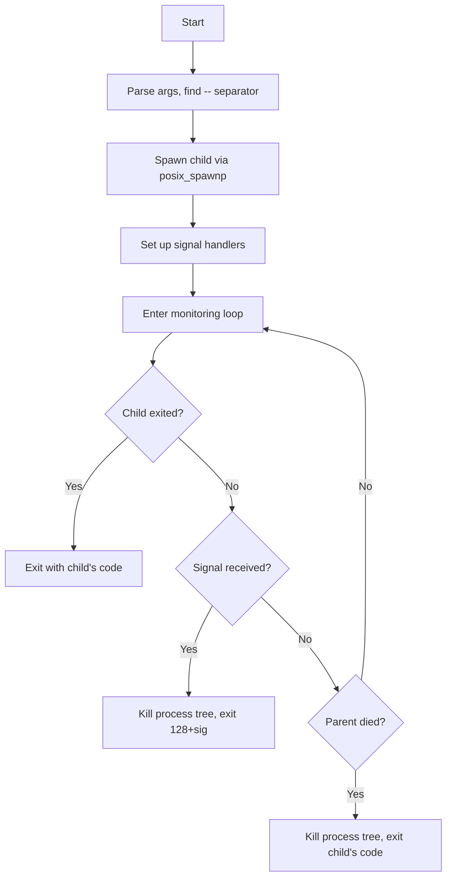

# Sources — CodexBarClaudeWatchdog

<think>
Let me analyze this module carefully to write comprehensive documentation.

## Understanding the Module

This is a standalone executable called `CodexBarClaudeWatchdog` that acts as a process supervisor/watchdog. Let me break down what it does:

1. **Purpose**: Spawns a child process and monitors it, ensuring proper cleanup when the watchdog receives termination signals or when the watchdog's parent dies (orphaned).

2. **Key Functions**:
   - `usageAndExit()`: Prints usage info and exits
   - `killProcessTree()`: Kills the child process and its entire process group
   - `exitCode()`: Translates wait status to proper exit code
   - `terminateChild()`: Wrapper to kill the child process tree
   - `handleTerminationSignal()`: Signal handler for SIGTERM, SIGINT, SIGHUP

3. **Execution Flow**:
   - Parse command line arguments (expects `--` separator)
   - Spawn the child process using `posix_spawnp`
   - Set up signal handlers
   - Enter main loop that:
     - Checks if child has exited
     - Checks if watchdog received termination signal
     - Checks if parent process died (ppid == 1, meaning reaped by init)
   - On any of these conditions, kills the process tree and exits with appropriate code

4. **Key Behaviors**:
   - Uses `setpgid` to put child in its own process group (allows killing entire tree)
   - Graceful termination: sends SIGTERM, waits 0.5s, then SIGKILL if needed
   - Returns child's exit code to parent
   - Returns 128 + signal for forced terminations

This is a "daemontools" style supervise process - a classic pattern in Unix systems.

Let me structure the documentation:

1. Overview/Purpose
2. How It Works (the main flow)


3. Command-line Interface
4. Signal Handling
5. Process Group Management
6. Exit Codes
7. Design Rationale
8. Usage Example

I'll create a simple Mermaid diagram to show the architecture since it helps visualize the watchdog-child relationship.
</think>

# CodexBarClaudeWatchdog — Process Supervisor

The `CodexBarClaudeWatchdog` module implements a minimal process supervisor that spawns a child process, monitors its lifecycle, and ensures proper cleanup when the supervisor itself receives termination signals or becomes orphaned.

## Purpose

This watchdog is designed to manage long-running child processes in a robust, Unix-friendly way:

- **Lifecycle management**: Spawn a child and wait for it to complete
- **Signal forwarding**: Forward termination signals (SIGTERM, SIGINT, SIGHUP) to the child
- **Orphan detection**: Detect when the watchdog's parent has died (adopted by init/PID 1) and clean up the child
- **Process group cleanup**: Kill the entire process tree, not just the direct child

It follows the classic "supervise" pattern used by tools like `daemontools`, `runit`, and systemd.

## Usage

```bash
CodexBarClaudeWatchdog -- <binary> [args...]
```

The `--` separator is required. Everything after it is passed as the child process arguments.

```bash
# Example: run Claude Code with the watchdog
CodexBarClaudeWatchdog -- claude --dangerously-skip-permissions .
```

## How It Works



### Initialization

1. **Argument parsing**: The module expects `CodexBarClaudeWatchdog -- <binary> [args...]`. It locates the `--` separator and treats everything after it as the child command.
2. **Process spawning**: Uses `posix_spawnp()` to create the child process, inheriting the environment from `environ`.
3. **Process group isolation**: Calls `setpgid(globalChildPID, globalChildPID)` to place the child in its own process group—this enables killing the entire tree later.

### Monitoring Loop

The main loop runs every ~200ms and checks three conditions:

| Condition | Action |
|-----------|--------|
| Child has exited | Exit with child's exit code |
| Watchdog received a signal (SIGTERM, SIGINT, SIGHUP) | Kill process tree, exit with code `128 + signal` |
| Parent process died (PPID == 1) | Kill process tree, exit with child's exit code |

### Process Tree Termination

When the watchdog needs to stop the child, it performs a graceful shutdown:

1. Send SIGTERM to the child's entire process group (`kill(-pgid, SIGTERM)`)
2. Wait up to 0.5 seconds for the child to exit
3. If the child persists, send SIGKILL to the process group

This two-phase approach gives the child a chance to handle cleanup (flush buffers, release resources) before being forcefully terminated.

## Exit Codes

| Code | Meaning |
|------|---------|
| 0-255 | Child's native exit status |
| 64 | Usage error (missing arguments) |
| 70 | Failed to spawn child |
| 128 + n | Watchdog terminated by signal n |

## Signal Handling

The watchdog installs handlers for three signals:

- **SIGTERM**: Graceful termination request
- **SIGINT**: Interrupt (Ctrl+C)
- **SIGHUP**: Hangup (often used to signal config reload or restart)

When any of these arrive, the watchdog:
1. Records the signal number in `globalShouldTerminate`
2. Kills the process tree
3. Exits with code `128 + signal`

This allows the parent (or container orchestrator) to know the watchdog was intentionally stopped, not that it crashed.

## Key Implementation Details

### Process Group Management

```swift
let pgid = getpgid(childPID)
kill(-pgid, SIGTERM)  // Negative PID = kill entire process group
```

By putting the child in its own process group, we can kill all descendant processes (any subprocesses the child may have spawned) with a single signal.

### Exit Code Extraction

Unix `wait` status encoding is quirky. The module manually decodes it:

```swift
let low = status & 0x7F  // Lower 7 bits = signal number (0 = no signal)
if low == 0 {
    return (status >> 8) & 0xFF  // Upper byte = exit status
}
// Otherwise: process was killed by signal
```

### Global State

The module uses `nonisolated(unsafe)` globals for inter-thread communication:

```swift
private nonisolated(unsafe) var globalChildPID: pid_t = 0
private nonisolated(unsafe) var globalShouldTerminate: Int32 = 0
```

These allow the signal handler (which runs asynchronously) to communicate with the main loop.

## Why This Exists

This watchdog provides reliability guarantees that simple process spawning lacks:

1. **Orphan handling**: If the watchdog's parent dies unexpectedly, the child is cleaned up rather than becoming a zombie or orphan.
2. **Signal propagation**: The watchdog shields the child from signals until it's ready to handle them, or ensures clean shutdown.
3. **Process group isolation**: Child subprocesses are guaranteed to be cleaned up, not just the immediate child.

In the broader CodexBar system, this watchdog likely wraps Claude Code or similar tools to ensure they're managed correctly within a larger process supervision tree.