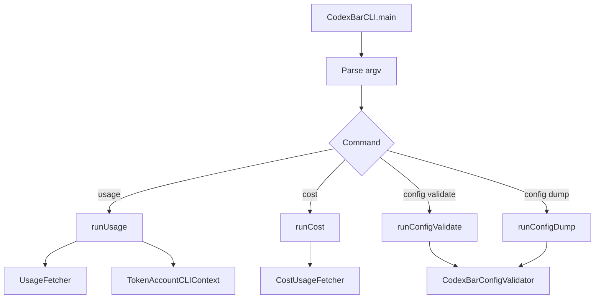

# Sources — CodexBarCLI

<think>
Let me analyze this module to understand its purpose and structure.

The CodexBarCLI module is a command-line interface for the CodexBar application. It provides commands to:
1. `usage` - Print usage from enabled providers (text or JSON)
2. `cost` - Print local cost usage from Claude/Codex JSONL logs
3. `config validate` - Validate config file
4. `config dump` - Print normalized config JSON

Let me identify the key components:

1. **CLIEntry.swift** - Main entry point (`@main` enum) that handles command routing
2. **CLIOptions.swift** - Command-line option definitions (UsageOptions, CostOptions, ConfigOptions)
3. **CLIUsageCommand.swift** - Implementation of the `usage` command
4. **CLICostCommand.swift** - Implementation of the `cost` command
5. **CLIConfigCommand.swift** - Implementation of config commands
6. **CLIErrorReporting.swift** - Error handling and JSON payloads
7. **CLIHelpers.swift** - Various helper functions
8. **CLIIO.swift** - I/O operations (stderr, version, help)
9. **CLIExitCode.swift** - Exit codes
10. **CLIOutputPreferences.swift** - Output format preferences
11. **CLIPayloads.swift** - JSON payload structures
12. **CLIRenderer.swift** - Text rendering for CLI output
13. **TokenAccountCLI.swift** - Token account handling
14. **CLIHelp.swift** - Help text strings

This is a well-structured CLI application. Let me write documentation that explains:
- What the module does
- The command structure
- Key components
- How to use it
- Error handling
- Output formats
- How it connects to other modules (CodexBarCore)

I should create a diagram showing the command structure and how things flow. A small diagram showing the main commands would be helpful.
</think>

# CodexBarCLI Module Documentation

The CodexBarCLI module implements the command-line interface for CodexBar, providing commands to query usage data, cost information, and manage configuration for multiple AI provider integrations.

## Overview

CodexBarCLI exposes four main commands through a unified CLI interface:

- **`usage`** — Query usage data from enabled AI providers
- **`cost`** — Display local token cost from Claude/Codex JSONL logs  
- **`config validate`** — Validate the configuration file
- **`config dump`** — Output normalized configuration as JSON

The CLI supports both text and JSON output formats, extensive filtering options, and handles provider-specific nuances (e.g., web vs CLI sources on macOS).

## Command Architecture



## Key Components

### Entry Point

**`CLIEntry.swift`** — The `@main` enum containing `main()` which:
1. Parses command-line arguments
2. Resolves the command path (e.g., `["usage"]` or `["config", "validate"]`)
3. Bootstraps logging based on flags
4. Dispatches to the appropriate handler

### Command Options

| File | Command | Key Options |
|------|---------|-------------|
| `CLIOptions.swift` | `usage` | `--provider`, `--account`, `--source`, `--format`, `--status` |
| `CLICostCommand.swift` | `cost` | `--provider`, `--refresh` |
| `CLIConfigCommand.swift` | `config` | `--format`, `--pretty` |

All options are defined using the `Commander` library's `@Option` and `@Flag` property wrappers.

### Output Rendering

**`CLIRenderer.swift`** — Renders usage snapshots as formatted text with:
- Progress bars showing remaining quota
- Color-coded status indicators
- Pace calculations for weekly usage
- Reset time displays

**`CLIOutputPreferences.swift`** — Encapsulates output preferences including format (text/json), JSON-only mode, and pretty-printing.

### Error Handling

**`CLIErrorReporting.swift`** — Provides consistent error handling:
- `CLIErrorKind` categorizes errors (args, config, provider, runtime)
- `ProviderErrorPayload` encodes errors in JSON responses
- `mapError()` converts Swift errors to exit codes

**`CLIExitCode.swift`** — Defines exit codes:
- `0` — Success
- `1` — General failure
- `2` — Binary not found
- `3` — Parse error
- `4` — Timeout

### Token Account Support

**`TokenAccountCLI.swift`** — Handles multi-account scenarios:
- Resolves accounts by label, index, or fetches all
- Applies account context to API requests
- Supports OAuth tokens for Claude

## Usage Examples

```bash
# Default usage (text output)
codexbar

# Specific provider in JSON
codexbar usage --provider claude --json --pretty

# All providers with status
codexbar usage --provider all --status

# Local cost only (no web required)
codexbar cost --provider claude

# Validate config
codexbar config validate

# Dump config as JSON
codexbar config dump --pretty
```

## Output Formats

### Text Output

```
== Claude 1.0 (cli) ==
Today: 78% ████████░░░░
Resets in 6h 23m

Last 7 days: 45% █████░░░░░░
Pace: On pace | Expected 45% used
Resets in 6d
```

### JSON Output

```json
[
  {
    "provider": "claude",
    "account": "work@example.com",
    "version": "1.0",
    "source": "cli",
    "status": { "indicator": "none", "description": null },
    "usage": { ... },
    "credits": null,
    "error": null
  }
]
```

## Provider Integration

The CLI integrates with multiple providers through the `ProviderDescriptorRegistry` and `ProviderFetchContext`. Key integration points:

1. **Source Modes** — Providers support different fetch strategies: `cli`, `web`, `oauth`, `api`, `local`
2. **Status Pages** — Fetches provider status from `api/v2/status.json` endpoints
3. **Token Accounts** — Per-provider account resolution with environment injection

## Configuration

The CLI loads configuration from `CodexBarConfigStore`:

```swift
let config = Self.loadConfig(output: output)
```

If loading fails, it exits with a JSON or text error depending on output preferences.

## Dependencies

The module imports:
- `CodexBarCore` — Core types and providers
- `Commander` — CLI argument parsing