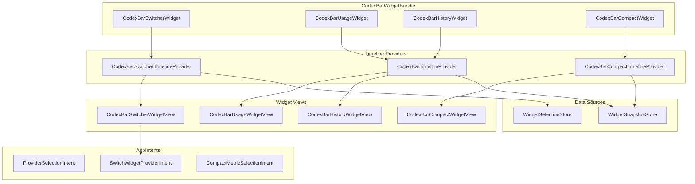

# Sources — CodexBarWidget

<think>
Let me analyze this module to understand its purpose and structure.

This is a SwiftUI Widget module for the CodexBar app. It provides various home screen widgets that display AI provider usage information. Let me break down what I see:

1. **CodexBarWidgetBundle.swift** - The main entry point that bundles 4 different widgets:
   - CodexBarSwitcherWidget - Allows switching between providers
   - CodexBarUsageWidget - Shows session and weekly usage with credits/costs
   - CodexBarHistoryWidget - Shows usage history chart
   - CodexBarCompactWidget - Small widget for single metrics

2. **CodexBarWidgetProvider.swift** - Contains:
   - ProviderChoice enum - Maps UsageProvider to widget-friendly selection
   - CompactMetric enum - Metrics for the compact widget
   - AppIntents for configuration (ProviderSelectionIntent, SwitchWidgetProviderIntent, CompactMetricSelectionIntent)
   - Timeline providers (CodexBarTimelineProvider, CodexBarSwitcherTimelineProvider, CodexBarCompactTimelineProvider)
   - Entry types (CodexBarWidgetEntry, CodexBarCompactEntry, CodexBarSwitcherEntry)
   - WidgetPreviewData for placeholder content

3. **CodexBarWidgetViews.swift** - Contains all the SwiftUI views for the widgets:
   - Main widget views (CodexBarUsageWidgetView, CodexBarHistoryWidgetView, etc.)
   - Various sub-views (CompactMetricView, ProviderSwitcherRow, etc.)
   - Chart views (UsageHistoryChart)
   - Helper views (HeaderView, UsageBarRow, ValueLine)
   - WidgetColors and WidgetFormat enums for styling and formatting

The module depends on:
- SwiftUI
- WidgetKit
- AppIntents
- CodexBarCore (external module with UsageProvider, WidgetSnapshot, etc.)


- Widgets pull usage data from WidgetSnapshotStore and persist provider selections through WidgetSelectionStore, with refresh intervals set at 30 minutes. I'll organize the documentation to cover the module's purpose, the four widget types, the provider system, configuration intents, and data flow.
</think>

# CodexBarWidget Module

The CodexBarWidget module provides iOS home screen widgets that display AI provider usage statistics. Users can monitor their session usage, weekly limits, credits, costs, and usage history directly from the home screen without opening the app.

## Overview

This module implements four distinct widget types through WidgetKit, each designed for different display sizes and information needs. The widgets read usage data from a shared snapshot stored by the main app and display real-time (or near-real-time) information about AI provider consumption.

The module depends on **CodexBarCore**, which provides:
- `UsageProvider` — the enumeration of supported AI providers
- `WidgetSnapshot` — the data structure containing usage information
- `ProviderDefaults` — metadata (display names, labels) for each provider



## Widget Types

### CodexBarSwitcherWidget
The switcher widget allows users to toggle between multiple AI providers directly from the home screen. It displays usage bars for the selected provider and includes interactive chips to switch providers.

- **Families**: `.systemSmall`, `.systemMedium`, `.systemLarge`
- **Configuration**: Static (no user intent on initial add)
- **Interactive**: Uses `SwitchWidgetProviderIntent` to change the active provider

### CodexBarUsageWidget
The primary usage widget displays session and weekly usage bars, remaining credits, and token costs.

- **Families**: `.systemSmall`, `.systemMedium`, `.systemLarge`
- **Configuration**: `ProviderSelectionIntent` — user selects a provider when adding the widget
- **Data**: Primary rate window, secondary (weekly) rate window, credits remaining, token usage summary

### CodexBarHistoryWidget
Shows a 7-day usage history chart with today's and 30-day totals.

- **Families**: `.systemMedium`, `.systemLarge`
- **Configuration**: `ProviderSelectionIntent`
- **Data**: Daily usage points array, session and 30-day cost/token summaries

### CodexBarCompactWidget
A minimal widget for systemSmall family that displays a single metric: credits left, today's cost, or 30-day cost.

- **Family**: `.systemSmall` only
- **Configuration**: `CompactMetricSelectionIntent` — user selects both provider and metric

## Provider System

### ProviderChoice Enum

`ProviderChoice` bridges between the app's `UsageProvider` enum and the widget configuration system. It conforms to `AppEnum` to enable picker UI in widget configuration.

```swift
enum ProviderChoice: String, AppEnum {
    case codex, claude, gemini, antigravity, zai, copilot, minimax, opencode
    // ...
}
```

**Key behavior**: The enum filters which providers are available in widgets. Several providers from `UsageProvider` return `nil` from the initializer because they aren't yet supported in widgets:

- `cursor`, `factory`, `vertexai`, `kiro`, `augment`, `jetbrains`, `kimi`, `kimik2`, `amp`, `ollama`, `synthetic`, `openrouter`, `warp`

The `availableProviders(from:)` method in `CodexBarSwitcherTimelineProvider` filters the snapshot's enabled providers to only those with a corresponding `ProviderChoice`.

### CompactMetric Enum

Defines the three metrics available in the compact widget:

- `.credits` — remaining credits
- `.todayCost` — current session cost in USD
- `.last30DaysCost` — rolling 30-day cost

## Timeline Providers

Each widget type has a corresponding timeline provider that creates timeline entries. All providers follow the same refresh policy: `.after(30 minutes)`.

### CodexBarTimelineProvider
Used by both `CodexBarUsageWidget` and `CodexBarHistoryWidget`. Implements `AppIntentTimelineProvider` to receive the `ProviderSelectionIntent` configuration.

### CodexBarSwitcherTimelineProvider
A `TimelineProvider` (non-AppIntent) because the switcher widget stores its selected provider separately via `WidgetSelectionStore`. This allows the widget to remain interactive without reconfiguration.

### CodexBarCompactTimelineProvider
Another `AppIntentTimelineProvider`, receiving both provider and metric selection from `CompactMetricSelectionIntent`.

## Data Flow

### Reading Usage Data

```swift
let snapshot = WidgetSnapshotStore.load() ?? WidgetPreviewData.snapshot()
```

All timeline providers load `WidgetSnapshot` from `WidgetSnapshotStore`. This snapshot is written by the main CodexBar app when it refreshes usage data. If no snapshot exists (widget added before first app launch), preview data provides placeholder values.

### Storing Provider Selection

The switcher widget uses `WidgetSelectionStore` to persist the user's chosen provider:

```swift
WidgetSelectionStore.saveSelectedProvider(self.provider.provider)
// Later, when building the timeline:
let stored = WidgetSelectionStore.loadSelectedProvider()
```

### Interactive Provider Switching

When a user taps a provider chip in the switcher widget, `SwitchWidgetProviderIntent` executes:

```swift
func perform() async throws -> some IntentResult {
    WidgetSelectionStore.saveSelectedProvider(self.provider.provider)
    WidgetCenter.shared.reloadAllTimelines()
    return .result()
}
```

This saves the selection and triggers an immediate widget refresh.

## Widget Views

The views in `CodexBarWidgetViews.swift` follow a consistent pattern:

1. **Extract provider entry** from snapshot based on the selected provider
2. **Choose layout** based on `@Environment(\.widgetFamily)` 
3. **Render content** or show empty state if no data available

### View Hierarchy

```
CodexBarUsageWidgetView
├── SmallUsageView
├── MediumUsageView
└── LargeUsageView

CodexBarHistoryWidgetView
└── HistoryView (adapts to size)

CodexBarCompactWidgetView
└── CompactMetricView

CodexBarSwitcherWidgetView
├── ProviderSwitcherRow
│   └── ProviderSwitchChip (interactive)
├── SwitcherSmallUsageView
├── SwitcherMediumUsageView
└── SwitcherLargeUsageView
```

### Shared Components

- **HeaderView** — Provider name and relative timestamp
- **UsageBarRow** — Horizontal progress bar with percentage
- **ValueLine** — Label + value pair
- **UsageHistoryChart** — 7-day bar chart
- **WidgetColors** — Provider-specific brand colors
- **WidgetFormat** — Formatting helpers for currency, percentages, token counts

## Customization

### Widget Colors

`WidgetColors` maps each `UsageProvider` to a brand-appropriate `Color`. These colors are used for:
- Usage bar fills
- History chart bars
- Chip backgrounds when selected

### Widget Preview Data

`WidgetPreviewData` provides hardcoded sample data for:
- Placeholder view (shown during widget gallery browsing)
- Fallback when no real snapshot exists

The preview data includes realistic values: 35% session usage, 60% weekly usage, 1,243.4 credits, and a week's worth of daily usage points.

## Configuration Display Strings

Each widget declares its configuration intent through `configurationDisplayName` and `description`:

| Widget | Display Name | Description |
|--------|--------------|-------------|
| Switcher | "CodexBar Switcher" | "Usage widget with a provider switcher." |
| Usage | "CodexBar Usage" | "Session and weekly usage with credits and costs." |
| History | "CodexBar History" | "Usage history chart with recent totals." |
| Compact | "CodexBar Metric" | "Compact widget for credits or cost." |

## Integration Notes

When adding this module to a project:

1. **WidgetSnapshotStore** must be implemented in the main app (or a shared framework) to provide usage data
2. **WidgetSelectionStore** must persist the selected provider (UserDefaults is typical)
3. The widget bundle must be registered in the app's target
4. The main app should write to `WidgetSnapshotStore` periodically so widgets have fresh data