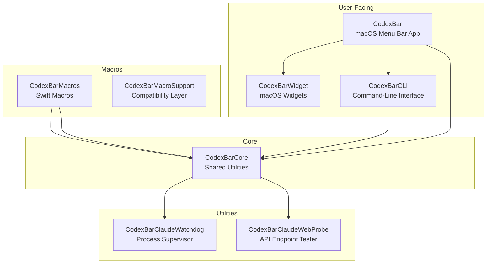

# Sources

<think>
The user wants me to write documentation for the "Sources" module, which contains multiple sub-modules. Let me analyze what each sub-module does and then synthesize how they work together.

Based on the analysis provided:

1. **CodexBar** - Main macOS menu bar application
2. **CodexBarCLI** - Command-line interface for usage/cost queries
3. **CodexBarClaudeWatchdog** - Process supervisor that monitors Claude CLI
4. **CodexBarClaudeWebProbe** - Network probe to test Claude.ai API endpoints
5. **CodexBarCore** - Shared utilities: browser cookie handling, config, keychain, notifications
6. **CodexBarMacroSupport** - Placeholder module (historical)
7. **CodexBarMacros** - Swift macros for provider descriptor registration
8. **CodexBarWidget** - macOS widgets for usage display

Let me write a summary that explains:
- What the overall Sources module is about
- How the sub-modules relate to each other
- Key workflows that span multiple sub-modules

I should NOT re-read source code or repeat what's in individual docs. I should synthesize how they work together.

Let me create a Mermaid diagram that shows how the modules relate, then write the narrative.
</think>

# Sources — CodexBar

The Sources module is the complete codebase for **CodexBar**, a macOS menu bar application that integrates AI coding assistants (Claude, Codex, Copilot) into the development workflow.

The application provides real-time usage tracking, cost monitoring, and quick provider switching — all accessible from the macOS menu bar.

---

## Module Overview

The codebase is organized into eight sub-modules that work together to deliver a seamless AI assistant integration experience:

---

## How the Sub-Modules Work Together

### Core Application Stack

**[CodexBar](codexbar.md)** is the main macOS menu bar application. It presents usage statistics, cost tracking, and provider switching controls directly in the menu bar. This module orchestrates all other components.

**[CodexBarCore](codexbarcore.md)** provides the shared infrastructure that both the menu bar app and CLI depend on. Key capabilities include:

- Secure credential storage via Keychain (`CopilotTokenStore`, `CookieHeaderStore`)
- Browser cookie extraction for API authentication
- Configuration management and migration
- Cross-platform notifications

**[CodexBarMacros](codexbarmacros.md)** defines Swift macros that simplify provider registration. The `@ProviderDescriptorRegistration`, `@ProviderDescriptorDefinition`, and `@ProviderImplementationRegistration` macros reduce boilerplate by automatically generating the registration code for AI providers.

### User Interfaces

**[CodexBarCLI](codexbarcli.md)** provides a command-line interface for programmatic access. Developers can query usage data (`usage` command), retrieve cost metrics (`cost` command), and validate configurations — useful for CI/CD pipelines or terminal-based workflows.

**[CodexBarWidget](codexbarwidget.md)** delivers macOS home screen widgets showing usage stats, cost charts, and provider quick-switching. This lets users monitor AI usage without opening the main application.

### Background Services

**[CodexBarClaudeWatchdog](codexbarclaudiwatchdog.md)** is a lightweight supervisor that spawns and monitors the Claude CLI process. It ensures proper cleanup when the parent application exits or when termination signals are received, preventing orphaned Claude processes.

**[CodexBarClaudeWebProbe](codexbarclaudewebprobe.md)** is a diagnostic utility that tests connectivity to various Claude.ai API endpoints. It helps users and developers verify which endpoints are accessible, useful for troubleshooting authentication or network issues.

---

## Key Workflows

### Provider Authentication Flow

1. User installs an AI provider CLI (Claude, Codex, or Copilot)
2. **CodexBarCore** detects the provider and extracts cookies/tokens from the browser Keychain
3. The credentials are validated and stored securely
4. **CodexBarMacros** registers the provider with the descriptor registry for discovery

### Usage Tracking Flow

1. Provider CLI executes (monitored by **CodexBarClaudeWatchdog** if Claude)
2. JSONL logs are written with token usage and cost data
3. **CodexBar** reads these logs and aggregates metrics
4. Data is displayed in the menu bar, CLI, or widgets depending on the interface

### CLI Integration

Developers using the **CodexBarCLI** can:
- Query real-time usage: `codexbar-cli usage`
- Get cost breakdowns: `codexbar-cli cost`
- Validate configs: `codexbar-cli config validate`

---

## Related Documentation

- [CodexBar — Main Application](codexbar.md)
- [CodexBarCore — Shared Utilities](codexbarcore.md)
- [CodexBarMacros — Swift Macros](codexbarmacros.md)
- [CodexBarCLI — Command-Line Interface](codexbarcli.md)
- [CodexBarWidget — macOS Widgets](codexbarwidget.md)
- [CodexBarClaudeWatchdog — Process Supervisor](codexbarclaudiwatchdog.md)
- [CodexBarClaudeWebProbe — API Endpoint Tester](codexbarclaudewebprobe.md)