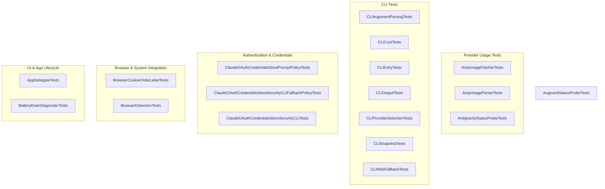

# Tests — CodexBarTests

<think>
The user wants me to write documentation for the Tests — CodexBarTests module. Let me analyze the source code files provided to understand what this module does.

Looking at the test files, I can see this is a comprehensive test suite for the CodexBar application. The tests cover:

1. **AmpUsageFetcherTests** - Tests for AMP usage fetching logic, including cookie attachment, login redirect detection
2. **AmpUsageParserTests** - Tests for parsing AMP usage data from HTML, including free tier usage parsing, error handling
3. **AntigravityStatusProbeTests** - Tests for parsing user status from Antigravity API
4. **AppDelegateTests** - Tests for app lifecycle and status controller initialization
5. **AugmentStatusProbeTests** - Tests for Augment status probing and cookie domain matching
6. **BatteryDrainDiagnosticTests** - Regression tests for battery drain issues with animation
7. **BrowserCookieOrderLabelTests** - Tests for browser-specific cookie order labels
8. **BrowserDetectionTests** - Tests for detecting installed browsers and cookie sources
9. **CLIArgumentParsingTests** - Tests for CLI argument parsing
10. **CLICostTests** - Tests for cost rendering and JSON encoding
11. **CLIEntryTests** - Tests for CLI entry points and helper functions
12. **CLIOutputTests** - Tests for CLI output formatting
13. **CLIProviderSelectionTests** - Tests for provider selection in CLI
14. **CLISnapshotTests** - Tests for rendering usage snapshots
15. **CLIWebFallbackTests** - Tests for web fallback logic
16. **ClaudeOAuthCredentialsStorePromptPolicyTests** - Tests for OAuth credentials store prompt policies
17. **ClaudeOAuthCredentialsStoreSecurityCLIFallbackPolicyTests** - Tests for security CLI fallback policies


18. **ClaudeOAuthCredentialsStoreSecurityCLITests** - Tests for security CLI credentials reading

This test module validates a menu bar application that monitors usage across multiple AI providers (Claude, Codex, Gemini, etc.), with the full source being quite extensive. The tests span authentication handling, usage tracking, CLI functionality, and integration with both web and native provider APIs.

I should structure the documentation to reflect how these components work together - starting with an overview of what CodexBar does, then moving through the test organization by functional area, and finally showing how they validate the core systems like provider selection, authentication, and CLI behavior.
</think>

# CodexBarTests Module Documentation

## Overview

The **CodexBarTests** module is the comprehensive test suite for the CodexBar application — a macOS menu bar utility that displays AI provider usage information (Claude Code, Codex, Gemini, Cursor, etc.) directly in the system status bar.

The test suite validates:
- **Provider usage fetching** — Retrieving usage data from various AI services
- **CLI functionality** — Command-line interface argument parsing, output rendering, and provider selection
- **Browser integration** — Detecting installed browsers and importing cookies for authentication
- **OAuth credentials** — Handling Claude OAuth tokens from the macOS keychain
- **UI behavior** — Status bar icon animation and battery drain diagnostics
- **Error handling** — Proper parsing and transformation of API responses

---

## Test Organization

The 18 test files are organized into logical groups by functionality:



---

## Provider Usage Tests

These tests verify that usage data is correctly fetched and parsed from various AI provider APIs.

### AmpUsageFetcherTests

Tests the `AmpUsageFetcher` component that handles requests to Amp (formerly Augment Code):

| Test | Validates |
|------|-----------|
| `attachesCookieForAmpHosts` | Cookie header is attached only for AMP host domains (`ampcode.com`, `app.ampcode.com`, etc.) |
| `rejectsNonAmpHosts` | Non-AMP domains and spoofed domains (e.g., `ampcode.com.evil.com`) are rejected |
| `detectsLoginRedirects` | Login URLs (`/auth/sign-in`, `/auth/sso`, `/login`, `/signin`) are correctly identified |
| `ignoresNonLoginURLs` | Settings, sign-out, and other non-login paths are not treated as login redirects |

### AmpUsageParserTests

Tests HTML parsing for Amp's free tier usage data:

- **Free tier parsing** — Extracts quota, used amount, hourly replenishment rate, and window hours from embedded JavaScript (`__sveltekit_x.data`)
- **Prefetched key parsing** — Handles the alternate data key `w6b2h6/getFreeTierUsage/`
- **Error handling** — Throws `parseFailed` when usage data is missing, `notLoggedIn` when signed out
- **Usage snapshot conversion** — Clamps percentages to 100%, handles missing window/replenishment values

### AntigravityStatusProbeTests

Validates parsing of the Antigravity API user status response, including model quotas, remaining fractions, and reset times.

---

## CLI Tests

The CLI tests validate the command-line interface (`codexbar` command) that displays usage information in the terminal.

### CLIArgumentParsingTests

Tests argument parsing for the `usage` subcommand:

- `--json` shortcut enables JSON format without enabling JSON logging
- `--json-output` flag enables structured logging output
- `--log-level` and `--verbose` are correctly parsed
- Format option (`--format text`) overrides the JSON shortcut
- `--json-only` forces JSON-only output mode

### CLICostTests

Tests the `cost` subcommand:

- Renders cost snapshots in text format with proper formatting
- Encodes cost payloads to JSON with correct field names (including cache read/creation tokens)

### CLIEntryTests

Tests core CLI entry points:

- Default command resolution (defaults to `usage` when no command provided)
- Format decoding from parsed arguments
- Provider selection logic with override support
- Version normalization
- Header generation
- Exit code mapping for various error types

### CLIProviderSelectionTests

Validates provider selection from CLI arguments:

- Help text includes all supported providers
- `--source` and `--web-timeout` flags are documented
- Provider override respects explicit selection
- "All" selection includes all enabled providers
- Primary pair (Codex + Claude) uses both by default
- Alias resolution (e.g., `kiro-cli` → `.kiro`)

### CLISnapshotTests

Tests rendering of usage snapshots:

- **Text rendering** — Correctly displays session percentage, weekly percentage, credits, account info, plan name
- **Provider-specific output** — Handles providers without weekly tracking, unlimited plans (Warp), credit-based plans
- **JSON encoding** — Produces valid JSON with correct date formatting
- **Color output** — Uses ANSI colors when TTY detected, applies correct colors for different usage levels
- **Status line** — Shows provider status (operational, degraded, critical) with appropriate coloring

### CLIWebFallbackTests

Tests the fallback logic when primary data sources fail:

- **Codex web fallback** — Falls back when cookies missing, account mismatch, access denied, or dashboard requires login
- **Claude CLI fallback** — Falls back to web only in app runtime with `.auto` source mode and valid cookies available
- **Claude web fallback** — Disabled for app `.auto` mode (uses native API instead)

---

## Authentication & Credentials Tests

These tests cover the OAuth credentials handling for Claude, including keychain integration.

### ClaudeOAuthCredentialsStorePromptPolicyTests

Tests prompt policy enforcement for keychain access:

| Scenario | Expected Behavior |
|----------|-------------------|
| Background + `.onlyOnUserAction` mode | Returns `.notFound` without prompting |
| User-initiated + `.onlyOnUserAction` mode | Successfully reads credentials |
| Pre-alert suppressed when readable without interaction | No pre-alert shown |
| Pre-alert shown when interaction required | Pre-alert triggered |
| Security CLI experimental reader succeeds | Skips pre-alert |
| Security CLI fails, fallback needs interaction | Pre-alert shown |

### ClaudeOAuthCredentialsStoreSecurityCLIFallbackPolicyTests

Tests the security CLI fallback policy:

- Background fallback is blocked when stored mode is `.onlyOnUserAction`
- Sync from keychain without prompt respects stored policy

### ClaudeOAuthCredentialsStoreSecurityCLITests

Tests the experimental security CLI reader:

- Prefers security CLI for non-interactive loads
- Background loads still execute security CLI read
- Falls back to keychain when security CLI unavailable

---

## Browser & System Integration Tests

### BrowserDetectionTests

Tests browser detection for cookie import:

- **Safari** — Always detected as installed
- **Chrome** — Requires profile data in `~/Library/Application Support/Google/Chrome/Default/`
- **Dia** — Requires profile data in `~/Library/Application Support/Dia/User Data/Default/`
- **Firefox** — Requires default profile directory with `cookies.sqlite`
- **Filtering** — Returns only browsers with usable cookie stores, preserves preference order

### BrowserCookieOrderLabelTests

Tests that error messages include browser-specific login hints (e.g., "Open Chrome and sign in to...").

### AugmentStatusProbeTests

Tests the Augment status probe and cookie domain matching:

- **Debug probe** — Returns formatted output with timestamp, status, credits balance
- **Ring buffer** — Maintains at most 5 recent dumps
- **Cookie domain matching** — Correctly handles exact match, parent domain, wildcard domain, and rejects mismatched domains

---

## UI & App Lifecycle Tests

### AppDelegateTests

Tests app lifecycle and controller initialization:

- Status controller is NOT built during `configure()`
- Status controller IS built once `applicationDidFinishLaunching` is called
- Subsequent launch notifications are idempotent (controller built only once)

### BatteryDrainDiagnosticTests

Regression tests for GitHub issues #269 and #139 (battery drain from animation):

| Condition | Expected Animation State |
|-----------|-------------------------|
| All providers disabled | No animation |
| Enabled provider with data | No animation |
| Enabled provider without data | Animates |

---

## Key Testing Patterns

### Test Framework

The module uses Swift Testing (`@Suite`, `@Test`) for most tests, with some XCTest compatibility:

```swift
@Suite
struct AmpUsageFetcherTests {
    @Test
    func attachesCookieForAmpHosts() {
        #expect(AmpUsageFetcher.shouldAttachCookie(to: URL(string: "https://ampcode.com/settings")))
    }
}
```

### Dependency Injection

Tests use dependency injection and test doubles:

```swift
// Override factory for testing
StatusItemController.factory = { _, _, _, _, _ in
    return DummyStatusController()
}
defer { StatusItemController.factory = StatusItemController.defaultFactory }
```

### Override Mechanisms

Complex components (like OAuth credentials) provide testing hooks:

```swift
try KeychainCacheStore.withServiceOverrideForTesting(service) {
    try KeychainAccessGate.withTaskOverrideForTesting(false) {
        // Test keychain behavior without actual system keychain
    }
}
```

---

## Running the Tests

```bash
# Run all CodexBarTests
swift test --filter CodexBarTests

# Run specific test suite
swift test --filter AmpUsageFetcherTests
swift test --filter CLIArgumentParsingTests

# Run with code coverage
swift test --enable-code-coverage --filter CodexBarTests
```

---

## Related Modules

The tests in this module exercise functionality from:

| Production Module | Purpose |
|------------------|---------|
| **CodexBarCore** | Core usage fetching, parsing, and provider abstraction |
| **CodexBar** | macOS menu bar app (AppDelegate, StatusItemController) |
| **CodexBarCLI** | Command-line interface |
| **SweetCookieKit** | Browser cookie import utilities |

---

## Maintenance Notes

- Tests marked `@MainActor` must run on the main thread (AppKit/UIKit dependencies)
- Some tests create temporary directories/files and clean up in `defer` blocks
- The ring buffer in `AugmentStatusProbe` is shared across tests — some tests account for this
- Battery drain tests conditionally skip in CI environments to avoid NSStatusBar issues